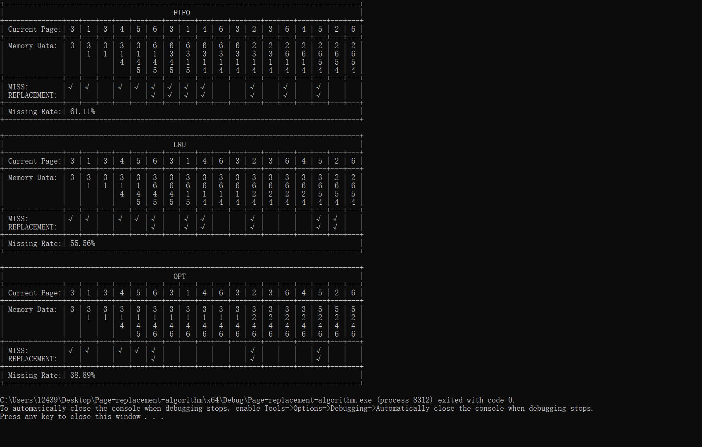

## Introduction
This project demonstrates the basic `page replacement` algorithm in C++ language.

### The specific algorithm implemented is as follows :
- FIFO (First-In, First-Out)
- LRU (Least Recently Used)
- OPT (Optimal Page Replacement)

### The operation effect is as follows :

## Other
You can modify the `accessSequence()` function to observe the results of the algorithm.
